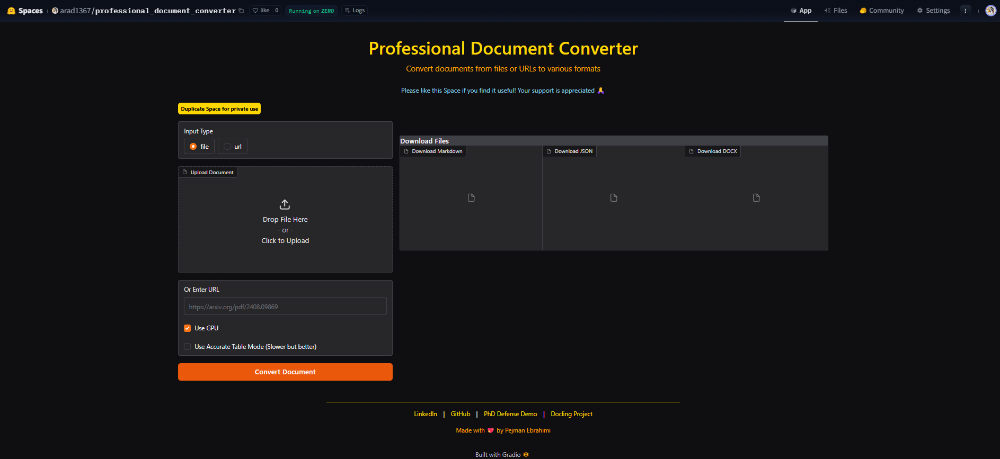

# Professional Document Converter



A professional document conversion tool that transforms PDFs into multiple formats including Markdown, JSON, and DOCX. Built with Docling and Gradio, this tool provides an intuitive interface for both file uploads and URL-based conversions.

## Table of Contents
- [Features](#features)
- [Demo](#demo)
- [Requirements](#requirements)
- [Installation](#installation)
- [Usage](#usage)
  - [Local Deployment](#local-deployment)
  - [Hugging Face Deployment](#hugging-face-deployment)
- [Project Structure](#project-structure)
- [Technical Details](#technical-details)
  - [Supported Input Formats](#supported-input-formats)
  - [Output Formats](#output-formats)
  - [Processing Options](#processing-options)
- [Contributing](#contributing)
- [Acknowledgments](#acknowledgments)
- [Contact](#contact)
- [License](#license)

## Features
- 📄 Convert PDF documents to multiple formats
- 🔗 Support for both file uploads and URL inputs
- 💾 Multiple output formats (Markdown, JSON, DOCX)
- 🎯 GPU acceleration support
- 📊 Advanced table extraction options
- 🎨 Clean and intuitive user interface
- ⚡ Real-time preview
- 💻 Easy deployment options

## Demo
Try out the live demo on Hugging Face Spaces: [Professional Document Converter](https://huggingface.co/spaces/arad1367/professional_document_converter)

## Requirements
```txt
docling
gradio>=4.0.0
--extra-index-url https://download.pytorch.org/whl/cu118
torch
pytesseract
python-docx
markdown
requests
```

## Installation

1. Clone the repository:
```bash
git clone https://github.com/arad1367/professional_document_converter.git
cd professional_document_converter
```

2. Create and activate a virtual environment (recommended):
```bash
python -m venv venv
source venv/bin/activate  # For Linux/Mac
# or
venv\Scripts\activate     # For Windows
```

3. Install dependencies:
```bash
pip install -r requirements.txt
```

4. Install Tesseract OCR:
   - **Windows**: Download and install from [UB-Mannheim/tesseract](https://github.com/UB-Mannheim/tesseract/wiki)
   - **Linux**: `sudo apt-get install tesseract-ocr`
   - **macOS**: `brew install tesseract`

## Usage

### Local Deployment
Run the local version with:
```bash
python local_app.py
```
Access the application at `http://127.0.0.1:7860`

### Hugging Face Deployment
The application can be deployed to Hugging Face Spaces using `app.py`. See [Hugging Face deployment documentation](https://huggingface.co/docs/hub/spaces) for details.

## Project Structure
```
professional_document_converter/
├── app.py              # Hugging Face Spaces deployment version
├── local_app.py        # Local deployment version
├── requirements.txt    # Project dependencies
├── UI.png             # User interface screenshot
├── README.md          # Project documentation
└── .gitignore         # Git ignore configuration
```

## Technical Details

### Supported Input Formats
- PDF files (upload)
- PDF URLs (direct links)

### Output Formats
| Format | Description | Use Case |
|--------|-------------|----------|
| Markdown | Clean, readable text format | Documentation, note-taking |
| JSON | Structured data format | API integration, data processing |
| DOCX | Microsoft Word format | Professional document editing |

### Processing Options
- **GPU Acceleration**: Enable/disable GPU processing
- **Table Mode**: 
  - Fast: Quick table extraction
  - Accurate: Detailed table structure preservation (slower)

## Contributing
Contributions are welcome! Please feel free to submit a Pull Request.

## Acknowledgments
- Special thanks to [Docling](https://github.com/DS4SD/docling) for their amazing document processing tool
- Built with [Gradio](https://gradio.app/) for the user interface
- Powered by PyTorch and Tesseract OCR

## Contact
- Pejman Ebrahimi
  - Academic: [pejman.ebrahimi@uni.li](mailto:pejman.ebrahimi@uni.li)
  - Personal: [pejman.ebrahimi77@gmail.com](mailto:pejman.ebrahimi77@gmail.com)
  - LinkedIn: [Pejman Ebrahimi](https://www.linkedin.com/in/pejman-ebrahimi-4a60151a7/)
  - GitHub: [@arad1367](https://github.com/arad1367)

## License
This project is licensed under the MIT License - see the LICENSE file for details.